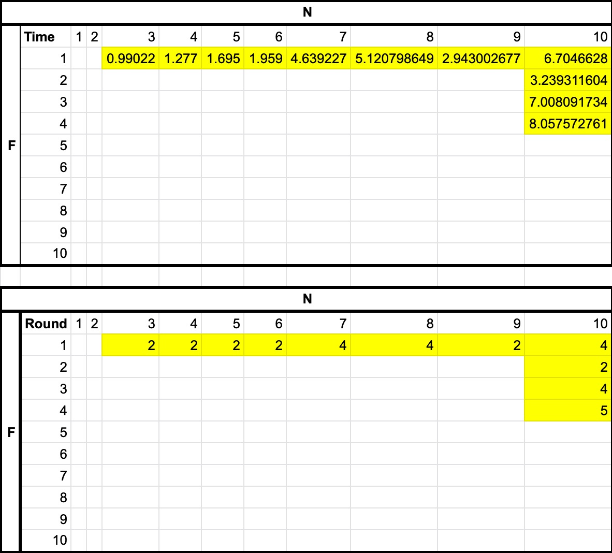

# MP3

By Socially Distancing Group

# How to Run

### config.txt

Included is a config file that has to specify N: number of nodes, f: Max number of faulty nodes, Process ID, Process IP, Process Port, and n/f: a Crash/No Crash designation

In config.txt first specify N and f:
```
100 1
```
Next, specify the server, which takes ID = 0
```
100 1
0 127.0.0.1 5000 n 
```
After, write how many nodes there will be

```
100 1
0 127.0.0.1 5000 n 
1 127.0.0.1 5002 n 
2 127.0.0.1 5002 n 
3 127.0.0.1 5003 n
etc.
```


### server.go

To start the server, first type on the command line,

```
go run server.go
```

The program will then create the server and wait for nodes to join.

```
go run server.go
```


### node.go

To start the nodes, use the shell script starter.sh, and edit the n parameter to the amount of (non-server) nodes included in config.txt

```
for i in {5001,n}
do
    go run node.go $i
done
```
After starting the server, start the nodes by executing:

```
bash jesuit.sh
```

After this, the program will commence and run until consensus is reached, upon which server.go will write:
```
Consensus Reached! Took x-rounds and y-seconds. 
```


### Faulty Nodes
To simulate an actual consensus routine, nodes designated with an "f" in the the config file have a chance to be faulty.
```
42 127.0.0.1 5042 f
```
Nodes designated as such have a random (20%) chance to terminate at the end of each round.  When this happens, the Node sends a message to the server before quitting to let the server know to remove it from calculations.


# Architecture and Design

The design includes one centralized server connecting to multiple clients using TCP. The server has no functional impact on the consensus process itself, but instead is there to check the states of the nodes at the end of each round and terminate the program once consensus is reached.

### Message
There is a struct of type Message that stores the state of a node and the current round.
```
type Message struct{
    State float64
    Round int   
}
```
### Node
Node package includes code that allow the node to constantly listen for incoming states, process them, and relay that information to the server. It also includes two goroutines, Listen(): which listens for messages from other nodes, and ListenForExit(): which waits for the exit command from the server once consensus is reached.

### Server
server.go includes the main function that first starts the tcp server.  While the states received from the nodes are not within 0.01 of each other, the server will continually iterate through the list of nodes, receive messages with their updated state values, and check if consensus has been reached or not.  Once consensus has been reached, it sends the exit command to the nodes telling them to stop and then prints out the rounds and time elapsed since starting.

### Config
config package contains methods that allow both the server and client to read the config file, allowing all connected processes to know the N: number of nodes, f: max faulty nodes, and information of all processes.  It also contains methods that print the config file in a readable format.

### Helper
helper package contains methods that help both server.go and node.go perform operations to progress through the rounds. We added helper.go for organization and readability purposes.

### Receiver
receiver package contains methods having to do with receiving tcp messages. It contains methods for both server.go and node.go to listen to incoming connections, as well is methods that process incoming messages.

### Sender
sender package contains methods having to do with sending tcp messages.  It contains Dial(), which establishes TCP connections, UnicastSend(), which sends messsages, delay() which prevents race conditions, and SendExit(), which the server uses to indicate that consensus has been reached. 

# Analysis


From our analysis, we can conclude that as N becomes larger or f becomes larger, both have negative impacts on the performance of the consensus routine.  Referring to the chart, as n or f became increasingly large, the amount of seconds and rounds it took for the routine to finsh increased as well.

We obseved that once the amount of crashed nodes == f, consensus is reached in round f + 1. This is because when all possible nodes fail, the remaining nonfaulty nodes all exchanged messages with each other next round. Then, they shared the same average (updated state) and the consensus is reached.

One thing to note is that since node crashes happen randomly (with 20% chance in our model), it is hard to say that our data reflects accurate result. During the rounds where nodes crashed early, we saw that the consensus was also reached early due to the reason previously mentioned. Therefore, if all possible nodes fail, the runtime of program was significantly reduced even when N was bigger. In the future, we would like to be able to run monte carlo simulations with N values ranging from N = 1 to N >> 1 and f ranging from f = 1 to f >> 1.  We believe that this would give better analysis.

# Notes
We manually indicated which nodes can be faulty or not. Ideally, this would happen compeletely randomly and programatically. 

Instead of continually receiving and acting on messages, we read messages into a queue array and then only process the first N-f messages.  Although this isn't a perfect representation of real-world consensus routines, this works for this MP. With more time, we would like to implement our code so that each process will listen to the incoming messages simulateneously and disregard those come after the (N-f)th message.

At first, each process connected with itself so that we could simulate "nodes sending messages to itself", but after discussing the design with Professor Tseng, we decided to instead receive N-f-1 messages then add its state y to the array (queue).